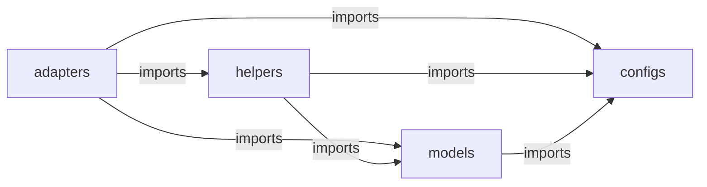
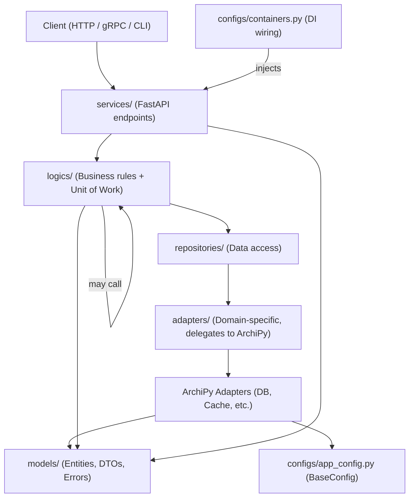

# Concepts

## Overview

ArchiPy is organized into four modules, each serving a specific role in structured Python applications:

1. **Adapters** — External service integrations
2. **Configs** — Configuration management
3. **Helpers** — Utility functions and cross-cutting concerns
4. **Models** — Core data structures

The design follows Clean Architecture principles: dependencies point inward toward the domain core, and each layer has a
single responsibility.

!!! note "Import Direction"
Imports flow in one direction only: `configs ← models ← helpers ← adapters`. Never import upward — for example, `models`
must not import from `adapters` or `helpers`.



## Modules

### Adapters

The `adapters` module provides external service integrations following the **Ports and Adapters** pattern (Hexagonal
Architecture). Every adapter directory contains a `ports.py` (abstract interface) and a `mocks.py` (test double).

- **Base Adapters** — SQLAlchemy base components and common session management
- **Database Adapters** — PostgreSQL, SQLite, StarRocks (each with SQLAlchemy integration)
- **Service Adapters** — Redis, Email, MinIO, Kafka, Keycloak, ScyllaDB, Temporal, Elasticsearch

### Configs

The `configs` module manages configuration loading, validation, and global access using Pydantic models:

- Environment-based configuration with `.env` support
- Type-safe validation via `pydantic_settings.BaseSettings`
- Centralized global accessor (`BaseConfig.global_config()`)

### Helpers

The `helpers` module contains utilities that are free of direct external I/O:

- **Utils** — Date, string, JWT, password, TOTP, and file utilities
- **Decorators** — Atomic transactions, TTL caching, retry, singleton
- **Interceptors** — FastAPI rate limiting, gRPC tracing and monitoring
- **Metaclasses** — Meta-programming utilities for advanced patterns

### Models

The `models` module defines the core data structures used across all layers:

- **Entities** — SQLAlchemy domain model objects
- **DTOs** — Pydantic `BaseModel` data transfer objects
- **Errors** — Custom exceptions extending `BaseError`
- **Types** — Enumerations and type definitions

## Architectural Flow



## Design Philosophy

ArchiPy provides standardized building blocks rather than enforcing a single pattern. The same components work across:

- Layered Architecture
- Hexagonal Architecture (Ports & Adapters)
- Clean Architecture
- Domain-Driven Design
- Service-Oriented Architecture

This lets teams maintain consistent practices while choosing the architectural style that fits their project.

## Core Building Blocks

### Configuration Management

```python
from archipy.configs.base_config import BaseConfig


class AppConfig(BaseConfig):
    """Application-specific configuration. Add custom fields here."""


config = AppConfig()
BaseConfig.set_global(config)
```

### Adapters and Ports

ArchiPy's **domain adapters** wrap ArchiPy base adapters via composition, owning all entity construction and query logic
for a single aggregate:

```python
import logging
from uuid import UUID, uuid4

from archipy.adapters.postgres.sqlalchemy.adapters import PostgresSQLAlchemyAdapter

from models.dtos.user.repository.user_dtos import CreateUserCommandDTO, UserResponseDTO
from models.entities.user import User

logger = logging.getLogger(__name__)


class UserDBAdapter:
    """Domain-specific adapter — delegates persistence to PostgresSQLAlchemyAdapter."""

    def __init__(self, db: PostgresSQLAlchemyAdapter) -> None:
        self._adapter = db

    def create_user(self, command: CreateUserCommandDTO) -> UserResponseDTO:
        """Build and persist a new User entity from a command DTO."""
        user = User(user_uuid=uuid4(), username=command.username, email=command.email)
        created = self._adapter.create(user)
        return UserResponseDTO(id=str(created.user_uuid), username=created.username, email=created.email)

    def get_user_by_uuid(self, user_id: UUID) -> UserResponseDTO | None:
        """Retrieve a User by UUID and map to a response DTO."""
        user = self._adapter.get_by_uuid(User, user_id)
        if not user:
            return None
        return UserResponseDTO(id=str(user.user_uuid), username=user.username, email=user.email)
```

### Entity Models

```python
import uuid

from sqlalchemy import String
from sqlalchemy.dialects.postgresql import UUID
from sqlalchemy.orm import Synonym, mapped_column

from archipy.models.entities.sqlalchemy.base_entities import BaseEntity


class User(BaseEntity):
    """User domain entity."""

    __tablename__ = "users"

    user_uuid = mapped_column(UUID(as_uuid=True), primary_key=True, default=uuid.uuid4)
    pk_uuid = Synonym("user_uuid")

    username = mapped_column(String(100), unique=True, nullable=False)
    email = mapped_column(String(255), unique=True, nullable=False)
```

### Data Transfer Objects

DTOs are split into two groups depending on which boundary they cross:

| Group          | DTO Type | Name Pattern           | Location                     | Purpose                                   |
|----------------|----------|------------------------|------------------------------|-------------------------------------------|
| **Domain**     | Input    | `{Operation}InputDTO`  | `dtos/{domain}/domain/v{n}/` | From client to service (versioned)        |
| **Domain**     | Output   | `{Operation}OutputDTO` | `dtos/{domain}/domain/v{n}/` | From logic to client (versioned)          |
| **Repository** | Command  | `{Action}CommandDTO`   | `dtos/{domain}/repository/`  | Write operations (create, update, delete) |
| **Repository** | Query    | `{Action}QueryDTO`     | `dtos/{domain}/repository/`  | Read operations (get, search, list)       |
| **Repository** | Response | `{Domain}ResponseDTO`  | `dtos/{domain}/repository/`  | Internal result from adapter/repository   |

Domain DTOs cross the public service boundary and are versioned (`v1/`, `v2/`). Repository DTOs are internal and never
versioned.

```python
# models/dtos/user/domain/v1/user_dtos.py — versioned, cross service boundary
from archipy.models.dtos.base_dtos import BaseDTO
from pydantic import EmailStr


class UserRegistrationInputDTO(BaseDTO):
    """Incoming registration request from the client."""
    username: str
    email: EmailStr


class UserRegistrationOutputDTO(BaseDTO):
    """Output DTO returned to the client after registration."""
    id: str
    username: str
    email: EmailStr
```

```python
# models/dtos/user/repository/user_dtos.py — internal, never versioned
from uuid import UUID
from archipy.models.dtos.base_dtos import BaseDTO
from pydantic import EmailStr


class CreateUserCommandDTO(BaseDTO):
    """Command DTO for creating a new user."""
    username: str
    email: EmailStr


class GetUserByIdQueryDTO(BaseDTO):
    """Query DTO for retrieving a single user by ID."""
    user_id: UUID


class UserResponseDTO(BaseDTO):
    """Internal response DTO from the repository layer."""
    id: str
    username: str
    email: EmailStr
```

## Recommended Project Structure

Domain-driven organization keeps related code together and scales naturally as the project grows:

```
my_app/
├── configs/
│   ├── app_config.py               # Application configuration
│   └── containers.py               # DI container — wires adapters, repos, logic
├── models/
│   ├── dtos/
│   │   ├── user/
│   │   │   ├── domain/             # Versioned input/output DTOs (service boundary)
│   │   │   │   ├── v1/
│   │   │   │   │   └── user_dtos.py
│   │   │   │   └── v2/             # Breaking domain DTO changes live here
│   │   │   │       └── user_dtos.py
│   │   │   └── repository/         # Internal command/query/response DTOs (no versioning)
│   │   │       └── user_dtos.py
│   │   └── order/
│   │       ├── domain/
│   │       │   └── v1/
│   │       │       └── order_dtos.py
│   │       └── repository/
│   │           └── order_dtos.py
│   ├── entities/                   # Domain entities
│   │   ├── user.py
│   │   └── order.py
│   └── errors/                     # Custom exceptions
│       ├── user_errors.py
│       └── order_errors.py
├── repositories/
│   ├── user/
│   │   ├── adapters/               # User-specific adapters (hold domain knowledge)
│   │   │   ├── user_db_adapter.py
│   │   │   └── user_cache_adapter.py
│   │   └── user_repository.py
│   └── order/
│       ├── adapters/
│       │   ├── order_db_adapter.py
│       │   └── order_payment_adapter.py
│       └── order_repository.py
├── logics/
│   ├── user/
│   │   ├── user_registration_logic.py
│   │   └── user_authentication_logic.py
│   └── order/
│       ├── order_creation_logic.py
│       └── order_payment_logic.py
├── services/
│   ├── user/
│   │   ├── v1/
│   │   │   └── user_service.py
│   │   └── v2/                     # Future API version
│   │       └── user_service.py
│   └── order/
│       └── v1/
│           └── order_service.py
└── main.py                         # Application entry point
```

Each layer has a clear, single responsibility:

- `main.py` — instantiates `UserContainer`, creates the FastAPI app, and passes the container into each `create_router`
  call
- `configs/app_config.py` — defines `AppConfig`, instantiates it, and calls `BaseConfig.set_global`; importing this
  module is sufficient to bootstrap the global config
- `configs/containers.py` — imports `app_config` to trigger config bootstrapping, then wires all adapters, repositories,
  and logic classes as thread-safe singletons
- `services/{domain}/v{n}/` — versioned FastAPI endpoints; receives input DTOs from clients and returns output DTOs
- `logics/` — pure business rules; accepts and returns DTOs; framework-agnostic and easily unit-tested; defines the *
  *unit of work boundary**

!!! note "Logic layer collaboration rules"
Logic classes **may call other logic classes** — for example, `OrderCreationLogic` may call `UserQueryLogic` to validate
that the buyer exists. Because both are decorated with `@postgres_sqlalchemy_atomic_decorator`, the nested call reuses
the same open session transparently.

    Logic classes **must never import or call a repository from another domain directly**. Cross-domain data access must go through the other domain's logic class. This keeps domain boundaries intact and ensures all cross-domain reads go through the correct unit of work.

    ```
    ✅  OrderCreationLogic  →  UserQueryLogic  →  UserRepository
    ❌  OrderCreationLogic  →  UserRepository  (bypasses domain boundary)
    ```

- `repositories/` — data access; delegates entity construction to the domain adapter and maps results to response DTOs
- `adapters/` — domain-specific wrappers around ArchiPy base adapters; own entity-construction and query knowledge

### Unit of Work

The **logic layer** is the unit of work boundary. Every public method on a logic class is decorated with
`@postgres_sqlalchemy_atomic_decorator`, which opens a session, commits on success, and rolls back on any exception —
then closes and removes the session to prevent leakage.

```
Service  →  Logic (@atomic)  →  Repository  →  Adapter  →  DB
                 ↑___________commit / rollback____________↑
```

This means:

- A single logic method can call multiple repository operations; they all participate in one transaction.
- If an inner call fails, the entire unit of work is rolled back automatically.
- Nested calls to other `@atomic`-decorated methods reuse the same session (the decorator detects an already-open
  transaction via the `in_postgres_sqlalchemy_atomic_block` flag and skips opening a new one).
- The session is never left open after a logic method returns — regardless of success or failure.

```python
from archipy.helpers.decorators.sqlalchemy_atomic import postgres_sqlalchemy_atomic_decorator

class UserRegistrationLogic:
    @postgres_sqlalchemy_atomic_decorator
    def register_user(self, input_dto: UserRegistrationInputDTO) -> UserRegistrationOutputDTO:
        # search + create run inside one transaction
        ...
```

## Complete Example

The following files walk through a full User domain from entity to HTTP endpoint.

### Config

```python
# configs/app_config.py
from archipy.configs.base_config import BaseConfig


class AppConfig(BaseConfig):
    """Application-specific configuration. Add custom fields here."""
    ...

config = AppConfig()
BaseConfig.set_global(config)
```

### DTOs

```python
# models/dtos/user/repository/user_dtos.py
from uuid import UUID

from pydantic import EmailStr

from archipy.models.dtos.base_dtos import BaseDTO


class CreateUserCommandDTO(BaseDTO):
    """Command DTO for creating a new user in the repository."""

    username: str
    email: EmailStr


class GetUserByIdQueryDTO(BaseDTO):
    """Query DTO for retrieving a single user by ID."""

    user_id: UUID


class SearchUsersQueryDTO(BaseDTO):
    """Query DTO for searching users with optional filters."""

    username: str | None = None
    email: str | None = None
    limit: int = 10
    offset: int = 0


class UserResponseDTO(BaseDTO):
    """Internal response DTO returned from the repository layer."""

    id: str
    username: str
    email: EmailStr
```

```python
# models/dtos/user/domain/v1/user_dtos.py
from uuid import UUID

from pydantic import EmailStr

from archipy.models.dtos.base_dtos import BaseDTO


class UserRegistrationInputDTO(BaseDTO):
    """Incoming registration request from the client."""

    username: str
    email: EmailStr


class UserRegistrationOutputDTO(BaseDTO):
    """Output DTO returned to the client after registration."""

    id: str
    username: str
    email: EmailStr


class UserGetInputDTO(BaseDTO):
    """Input DTO for retrieving a user by ID."""

    user_id: UUID


class UserGetOutputDTO(BaseDTO):
    """Output DTO returned to the client for a single user lookup."""

    id: str
    username: str
    email: EmailStr


class UserSearchInputDTO(BaseDTO):
    """Input DTO for searching users."""

    username: str | None = None
    limit: int = 10


class UserSummaryOutputDTO(BaseDTO):
    """Summary of a single user in a search result."""

    id: str
    username: str
    email: EmailStr


class UserSearchOutputDTO(BaseDTO):
    """Output DTO wrapping a list of matched users."""

    users: list[UserSummaryOutputDTO]
```

### Models

```python
# models/entities/user.py
import uuid

from sqlalchemy import String
from sqlalchemy.dialects.postgresql import UUID
from sqlalchemy.orm import Synonym, mapped_column

from archipy.models.entities.sqlalchemy.base_entities import BaseEntity


class User(BaseEntity):
    """User domain entity."""

    __tablename__ = "users"

    user_uuid = mapped_column(UUID(as_uuid=True), primary_key=True, default=uuid.uuid4)
    pk_uuid = Synonym("user_uuid")

    username = mapped_column(String(100), unique=True, nullable=False)
    email = mapped_column(String(255), unique=True, nullable=False)
```

```python
# models/errors/user_errors.py
from archipy.models.errors import AlreadyExistsError


class UserAlreadyExistsError(AlreadyExistsError):
    """Raised when attempting to create a user that already exists."""
```

### Adapters

```python
# repositories/user/adapters/user_db_adapter.py
import logging
from uuid import UUID, uuid4

from sqlalchemy import select

from archipy.adapters.postgres.sqlalchemy.adapters import PostgresSQLAlchemyAdapter

from models.dtos.user.repository.user_dtos import CreateUserCommandDTO, SearchUsersQueryDTO, UserResponseDTO
from models.entities.user import User

logger = logging.getLogger(__name__)


class UserDBAdapter:
    """Domain-specific database adapter for the User aggregate.

    Delegates all low-level persistence to a PostgresSQLAlchemyAdapter instance,
    while owning entity construction, query building, and entity-to-DTO mapping.
    """

    def __init__(self, db: PostgresSQLAlchemyAdapter) -> None:
        self._adapter = db

    def create_user(self, command: CreateUserCommandDTO) -> UserResponseDTO:
        """Build and persist a new User entity from a command DTO.

        Args:
            command: Data required to create the user.

        Returns:
            A response DTO for the newly created user.
        """
        user = User(user_uuid=uuid4(), username=command.username, email=command.email)
        created = self._adapter.create(user)
        return UserResponseDTO(id=str(created.user_uuid), username=created.username, email=created.email)

    def get_user_by_uuid(self, user_id: UUID) -> UserResponseDTO | None:
        """Retrieve a single User by UUID.

        Args:
            user_id: The UUID of the user to retrieve.

        Returns:
            A response DTO, or None if no matching user exists.
        """
        user = self._adapter.get_by_uuid(User, user_id)
        if not user:
            return None
        return UserResponseDTO(id=str(user.test_uuid), username=user.username, email=user.email)

    def search_users(self, query: SearchUsersQueryDTO) -> list[UserResponseDTO]:
        """Search users by optional username or email filters.

        Args:
            query: Filter criteria and pagination parameters.

        Returns:
            A list of matching user response DTOs.
        """
        db_query = select(User)
        if query.username:
            db_query = db_query.where(User.username.ilike(f"%{query.username}%"))
        if query.email:
            db_query = db_query.where(User.email.ilike(f"%{query.email}%"))
        db_query = db_query.limit(query.limit).offset(query.offset)
        users, _ = self._adapter.execute_search_query(User, db_query)
        return [UserResponseDTO(id=str(u.test_uuid), username=u.username, email=u.email) for u in users]
```

```python
# repositories/user/adapters/user_cache_adapter.py
from archipy.adapters.redis.adapters import RedisAdapter


class UserCacheAdapter:
    """Domain-specific cache adapter for the User aggregate.

    Delegates all low-level cache operations to a RedisAdapter instance,
    while owning User-specific key namespacing.
    """

    def __init__(self, cache: RedisAdapter) -> None:
        self._cache = cache

    def get_cache_key(self, user_id: str) -> str:
        """Build a namespaced cache key for a user."""
        return f"user:{user_id}"

    def get(self, key: str) -> str | None:
        """Retrieve a cached value by key."""
        return self._cache.get(key)

    def set(self, key: str, value: str, ex: int | None = None) -> None:
        """Store a value in the cache with an optional TTL."""
        self._cache.set(key, value, ex=ex)

    def delete(self, key: str) -> None:
        """Remove a cached value by key."""
        self._cache.delete(key)
```

### Repository

```python
# repositories/user/user_repository.py
import logging

from models.dtos.user.repository.user_dtos import (
    CreateUserCommandDTO,
    GetUserByIdQueryDTO,
    SearchUsersQueryDTO,
    UserResponseDTO,
)
from repositories.user.adapters.user_cache_adapter import UserCacheAdapter
from repositories.user.adapters.user_db_adapter import UserDBAdapter

logger = logging.getLogger(__name__)


class UserRepository:
    """Handles all User persistence and cache operations."""

    def __init__(
            self,
            db_adapter: UserDBAdapter,
            cache_adapter: UserCacheAdapter | None = None,
    ) -> None:
        self.db_adapter = db_adapter
        self.cache_adapter = cache_adapter

    def create_user(self, command: CreateUserCommandDTO) -> UserResponseDTO:
        """Persist a new user and invalidate any stale cache entry."""
        created = self.db_adapter.create_user(command)
        if self.cache_adapter:
            self.cache_adapter.delete(self.cache_adapter.get_cache_key(created.id))
        return created

    def get_user_by_id(self, query: GetUserByIdQueryDTO) -> UserResponseDTO | None:
        """Retrieve a user by ID, checking the cache first."""
        if self.cache_adapter:
            cached = self.cache_adapter.get(self.cache_adapter.get_cache_key(str(query.user_id)))
            if cached:
                return UserResponseDTO.model_validate_json(cached)

        response = self.db_adapter.get_user_by_uuid(query.user_id)
        if not response:
            return None

        if self.cache_adapter:
            self.cache_adapter.set(
                self.cache_adapter.get_cache_key(str(query.user_id)),
                response.model_dump_json(),
                ex=3600,
            )
        return response

    def search_users(self, query: SearchUsersQueryDTO) -> list[UserResponseDTO]:
        """Search users by username or email and return response DTOs."""
        return self.db_adapter.search_users(query)
```

### Logics

```python
# logics/user/user_registration_logic.py
import logging

from archipy.helpers.decorators.sqlalchemy_atomic import postgres_sqlalchemy_atomic_decorator

from models.dtos.user.domain.v1.user_dtos import UserRegistrationInputDTO, UserRegistrationOutputDTO
from models.dtos.user.repository.user_dtos import CreateUserCommandDTO, SearchUsersQueryDTO
from models.errors.user_errors import UserAlreadyExistsError
from repositories.user.user_repository import UserRepository

logger = logging.getLogger(__name__)


class UserRegistrationLogic:
    """Business logic for registering new users."""

    def __init__(self, user_repository: UserRepository) -> None:
        self.user_repository = user_repository

    @postgres_sqlalchemy_atomic_decorator
    def register_user(self, input_dto: UserRegistrationInputDTO) -> UserRegistrationOutputDTO:
        """Validate uniqueness and create a new user.

        Args:
            input_dto: Incoming registration data from the service layer.

        Returns:
            An output DTO for the newly created user.

        Raises:
            UserAlreadyExistsError: If a user with the given username already exists.
        """
        existing = self.user_repository.search_users(
            SearchUsersQueryDTO(username=input_dto.username, limit=1),
        )
        if existing:
            raise UserAlreadyExistsError(
                resource_type="user",
                additional_data={"username": input_dto.username},
            )

        created = self.user_repository.create_user(
            CreateUserCommandDTO(username=input_dto.username, email=input_dto.email),
        )
        return UserRegistrationOutputDTO(id=created.id, username=created.username, email=created.email)
```

```python
# logics/user/user_query_logic.py
import logging

from archipy.helpers.decorators.sqlalchemy_atomic import postgres_sqlalchemy_atomic_decorator
from archipy.models.errors import NotFoundError

from models.dtos.user.domain.v1.user_dtos import (
    UserGetInputDTO,
    UserGetOutputDTO,
    UserSearchInputDTO,
    UserSearchOutputDTO,
    UserSummaryOutputDTO,
)
from models.dtos.user.repository.user_dtos import GetUserByIdQueryDTO, SearchUsersQueryDTO
from repositories.user.user_repository import UserRepository

logger = logging.getLogger(__name__)


class UserQueryLogic:
    """Business logic for querying user data."""

    def __init__(self, user_repository: UserRepository) -> None:
        self.user_repository = user_repository

    @postgres_sqlalchemy_atomic_decorator
    def get_user_by_id(self, input_dto: UserGetInputDTO) -> UserGetOutputDTO:
        """Retrieve a user by ID, raising NotFoundError if absent.

        Args:
            input_dto: Contains the UUID of the user to retrieve.

        Returns:
            An output DTO for the matched user.

        Raises:
            NotFoundError: If no user with the given ID exists.
        """
        user = self.user_repository.get_user_by_id(GetUserByIdQueryDTO(user_id=input_dto.user_id))
        if not user:
            raise NotFoundError(resource_type="user", additional_data={"user_id": str(input_dto.user_id)})
        return UserGetOutputDTO(id=user.id, username=user.username, email=user.email)

    @postgres_sqlalchemy_atomic_decorator
    def search_users(self, input_dto: UserSearchInputDTO) -> UserSearchOutputDTO:
        """Search users by optional username filter.

        Args:
            input_dto: Search filters from the service layer.

        Returns:
            An output DTO wrapping the list of matched users.
        """
        results = self.user_repository.search_users(
            SearchUsersQueryDTO(username=input_dto.username, limit=input_dto.limit),
        )
        return UserSearchOutputDTO(
            users=[UserSummaryOutputDTO(id=u.id, username=u.username, email=u.email) for u in results],
        )
```

### DI Container

```python
# configs/containers.py
import configs.app_config  # noqa: F401 — importing triggers BaseConfig.set_global
from dependency_injector import containers, providers

from archipy.adapters.postgres.sqlalchemy.adapters import PostgresSQLAlchemyAdapter
from archipy.adapters.redis.adapters import RedisAdapter

from repositories.user.adapters.user_cache_adapter import UserCacheAdapter
from repositories.user.adapters.user_db_adapter import UserDBAdapter
from repositories.user.user_repository import UserRepository
from logics.user.user_query_logic import UserQueryLogic
from logics.user.user_registration_logic import UserRegistrationLogic


class UserContainer(containers.DeclarativeContainer):
    """Wires the User domain dependency graph using thread-safe singletons."""

    _postgres: providers.Provider[PostgresSQLAlchemyAdapter] = providers.ThreadSafeSingleton(
        PostgresSQLAlchemyAdapter,
    )

    _redis: providers.Provider[RedisAdapter] = providers.ThreadSafeSingleton(
        RedisAdapter,
    )

    _db_adapter: providers.Provider[UserDBAdapter] = providers.ThreadSafeSingleton(
        UserDBAdapter,
        db=_postgres,
    )

    _cache_adapter: providers.Provider[UserCacheAdapter] = providers.ThreadSafeSingleton(
        UserCacheAdapter,
        cache=_redis,
    )

    _repository: providers.Provider[UserRepository] = providers.ThreadSafeSingleton(
        UserRepository,
        db_adapter=_db_adapter,
        cache_adapter=_cache_adapter,
    )

    registration_logic: providers.Provider[UserRegistrationLogic] = providers.ThreadSafeSingleton(
        UserRegistrationLogic,
        user_repository=_repository,
    )

    query_logic: providers.Provider[UserQueryLogic] = providers.ThreadSafeSingleton(
        UserQueryLogic,
        user_repository=_repository,
    )
```

### Service (FastAPI Endpoints)

```python
# services/user/v1/user_service.py
import logging
from uuid import UUID

from fastapi import APIRouter, Depends, HTTPException

from archipy.models.errors import NotFoundError

from configs.containers import UserContainer
from logics.user.user_query_logic import UserQueryLogic
from logics.user.user_registration_logic import UserRegistrationLogic
from models.dtos.user.domain.v1.user_dtos import (
    UserGetInputDTO,
    UserGetOutputDTO,
    UserRegistrationInputDTO,
    UserRegistrationOutputDTO,
)
from models.errors.user_errors import UserAlreadyExistsError

logger = logging.getLogger(__name__)


def create_router(container: UserContainer) -> APIRouter:
    """Build and return the versioned user router wired to the given container.

    Args:
        container: The DI container providing logic instances.

    Returns:
        A configured APIRouter for the User domain.
    """
    router = APIRouter(prefix="/api/v1/users", tags=["users-v1"])

    @router.post("/", response_model=UserRegistrationOutputDTO, status_code=201)
    def register_user(
            input_dto: UserRegistrationInputDTO,
            registration_logic: UserRegistrationLogic = Depends(container.registration_logic),
    ) -> UserRegistrationOutputDTO:
        """Register a new user.

        Args:
            input_dto: Registration payload from the client.
            registration_logic: Injected registration logic.

        Returns:
            Output DTO for the newly created user.

        Raises:
            HTTPException: 409 if the username is already taken.
        """
        try:
            return registration_logic.register_user(input_dto)
        except UserAlreadyExistsError as e:
            raise HTTPException(status_code=409, detail=str(e)) from e

    @router.get("/{user_id}", response_model=UserGetOutputDTO)
    def get_user(
            user_id: str,
            query_logic: UserQueryLogic = Depends(container.query_logic),
    ) -> UserGetOutputDTO:
        """Retrieve a user by ID.

        Args:
            user_id: String representation of the user's UUID.
            query_logic: Injected query logic.

        Returns:
            Output DTO for the matched user.

        Raises:
            HTTPException: 404 if no user with the given ID exists.
            HTTPException: 400 if the user_id is not a valid UUID.
        """
        try:
            return query_logic.get_user_by_id(UserGetInputDTO(user_id=UUID(user_id)))
        except NotFoundError as e:
            raise HTTPException(status_code=404, detail=str(e)) from e
        except ValueError as e:
            raise HTTPException(status_code=400, detail="Invalid user ID format") from e

    return router
```

### Application Entry Point

```python
# main.py
from archipy.helpers.utils.app_utils import AppUtils

from configs.app_config import AppConfig  # noqa: F401 — triggers BaseConfig.set_global
from configs.containers import UserContainer
from services.user.v1.user_service import create_router as create_user_v1_router

user_container = UserContainer()

app = AppUtils.create_fastapi_app()
app.include_router(create_user_v1_router(user_container))

if __name__ == "__main__":
    import uvicorn
    from archipy.configs.base_config import BaseConfig

    config = BaseConfig.global_config()
    uvicorn.run(app, host=config.FASTAPI_HOST, port=config.FASTAPI_PORT)
```

By providing standardized building blocks rather than enforcing a single architecture, ArchiPy helps teams maintain
consistent practices while retaining the flexibility to choose the pattern that best fits their needs.

## See Also

- [Installation](installation.md)
- [Configuration Management](examples/config_management.md)
- [Error Handling](examples/error_handling.md)
- [PostgreSQL Adapter](examples/adapters/postgres.md)
- [BDD Testing](examples/bdd_testing.md)
- [API Reference](api_reference/index.md)
