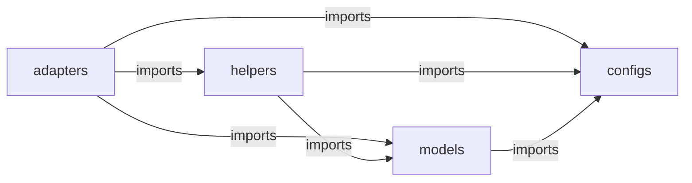
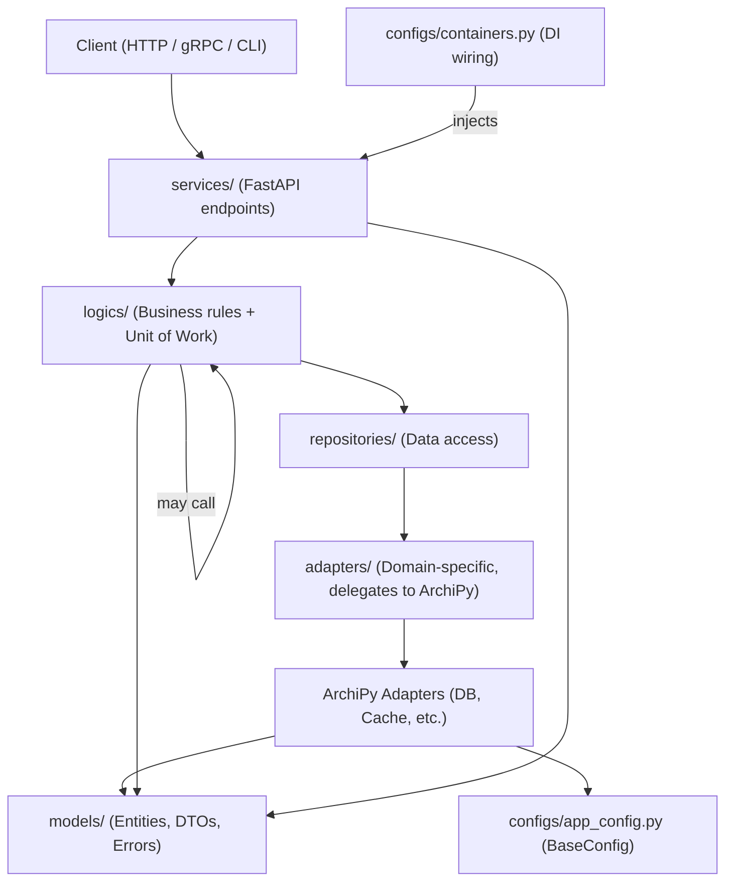

# Concepts

ArchiPy organises every application into four strictly separated layers. Understanding these layers — and their
import rules — is the foundation for writing maintainable, testable services.

## The Four Layers



| Layer        | Directory   | Responsibility                                                                  |
|--------------|-------------|---------------------------------------------------------------------------------|
| **Configs**  | `configs/`  | Type-safe, environment-based configuration via `pydantic_settings.BaseSettings` |
| **Models**   | `models/`   | Entities (SQLAlchemy), DTOs (Pydantic), Errors, Types — data structures only    |
| **Helpers**  | `helpers/`  | Pure utilities: decorators, interceptors, JWT, password, datetime               |
| **Adapters** | `adapters/` | External service integrations: databases, caches, queues, APIs                  |

!!! warning "One-way import rule"
Imports flow inward only — `configs ← models ← helpers ← adapters`. Inner layers never import
from outer layers. Violating this rule breaks testability and creates circular dependencies.

---

## Layer Details

### Configs

All configuration classes extend `pydantic_settings.BaseSettings`. Values are loaded from environment
variables or `.env` files and validated at startup:

```python
from archipy.configs.base_config import BaseConfig


class AppConfig(BaseConfig):
    """Application-specific configuration."""

    APP_NAME: str = "my-service"
    DEBUG: bool = False


config = AppConfig()
BaseConfig.set_global(config)
```

### Models

The models layer contains **data structures only** — no I/O, no business logic.

- **Entities** — SQLAlchemy domain model objects (`BaseEntity`)
- **DTOs** — Pydantic `BaseModel` for data transfer across layer boundaries
- **Errors** — Custom exception types extending `BaseError`
- **Types** — Enumerations and type aliases

DTOs are divided into two groups:

| Group               | Purpose                                       | Location                     | Versioned? |
|---------------------|-----------------------------------------------|------------------------------|------------|
| **Domain DTOs**     | Cross the service boundary (client ↔ service) | `dtos/{domain}/domain/v{n}/` | Yes        |
| **Repository DTOs** | Internal (logic ↔ repository ↔ adapter)       | `dtos/{domain}/repository/`  | No         |

### Helpers

The helpers layer contains pure utilities with no direct external I/O:

| Sub-package             | Contents                                                                     |
|-------------------------|------------------------------------------------------------------------------|
| `helpers/utils/`        | JWT, password, TOTP, datetime, string, file, Prometheus                      |
| `helpers/decorators/`   | `@atomic`, `@ttl_cache`, `@retry`, `@singleton`, `@timeout`, `@timing`       |
| `helpers/interceptors/` | FastAPI rate limiting and metrics; gRPC tracing, metrics, exception handling |
| `helpers/metaclasses/`  | `SingletonMeta` and other meta-programming utilities                         |

### Adapters

Adapters follow the **Ports & Adapters** (Hexagonal Architecture) pattern. Every adapter directory contains:

- `ports.py` — abstract interface (`ABC`) describing what the adapter can do
- `adapters.py` — concrete implementation against a real external service
- `mocks.py` (where available) — in-memory test double for unit tests

Your business logic imports only from `ports.py`. This means you can swap the implementation (real adapter
→ mock) without changing any business code.

---

## Architectural Flow



---

## Ports & Adapters in Practice

```
Production:  UserRepository → PostgresSQLAlchemyAdapter (real Postgres)
Test:        UserRepository → InMemorySQLAlchemyMock   (no Docker needed)
```

Your logic layer depends on the abstract port:

```python
from archipy.adapters.redis.ports import RedisPort
from archipy.models.errors import NotFoundError


class UserSessionService:
    """Manages user sessions using a cache.

    Args:
        cache: Any implementation of RedisPort (real or mock).
    """

    def __init__(self, cache: RedisPort) -> None:
        self._cache = cache

    def get_session(self, session_id: str) -> str:
        """Retrieve a session by ID.

        Args:
            session_id: The session identifier.

        Returns:
            Serialised session data.

        Raises:
            NotFoundError: If the session does not exist.
        """
        value = self._cache.get(f"session:{session_id}")
        if value is None:
            raise NotFoundError(resource_type="session")
        return value
```

In tests, inject `RedisMock` instead of `RedisAdapter` — no Redis server needed.

---

## Unit of Work

The **logic layer** is the unit of work boundary. Every public method on a logic class is decorated with
`@postgres_sqlalchemy_atomic_decorator`, which opens a SQLAlchemy session, commits on success, and rolls back
on any exception:

```
Service  →  Logic (@atomic)  →  Repository  →  Adapter  →  DB
                 ↑___________commit / rollback____________↑
```

```python
from archipy.helpers.decorators.sqlalchemy_atomic import postgres_sqlalchemy_atomic_decorator
from models.dtos.user.domain.v1.user_dtos import UserRegistrationInputDTO, UserRegistrationOutputDTO


class UserRegistrationLogic:
    """Handles user registration within a single database transaction."""

    @postgres_sqlalchemy_atomic_decorator
    def register_user(self, input_dto: UserRegistrationInputDTO) -> UserRegistrationOutputDTO:
        """Validate uniqueness and create a new user.

        Args:
            input_dto: Registration data from the service layer.

        Returns:
            Output DTO for the newly created user.
        """
        ...
```

!!! note "Logic layer collaboration rules"

- Logic classes **may call other logic classes** — nested `@atomic` calls reuse the open session.
- Logic classes **must never import or call a repository from another domain directly**.
  Cross-domain reads must go through the other domain's logic class.

    ```
    ✅  OrderCreationLogic  →  UserQueryLogic  →  UserRepository
    ❌  OrderCreationLogic  →  UserRepository  (bypasses domain boundary)
    ```

---

## Design Philosophy

ArchiPy provides standardised building blocks rather than enforcing a single architectural style. The same
components work across:

- Layered Architecture
- Hexagonal Architecture (Ports & Adapters)
- Clean Architecture
- Domain-Driven Design
- Service-Oriented Architecture

Teams maintain consistent practices while choosing the pattern that best fits their domain.

---

## See Also

- [Quickstart](quickstart.md) — five-minute "hello world" example
- [Project Structure](project_structure.md) — recommended folder layout
- [Configuration Management](../tutorials/config_management.md) — loading from `.env` files
- [Dependency Injection](../tutorials/dependency_injection.md) — wiring the full object graph
- [Testing Strategy](../tutorials/testing_strategy.md) — unit and integration test patterns
- [API Reference](../api_reference/index.md) — full reference for all public classes
