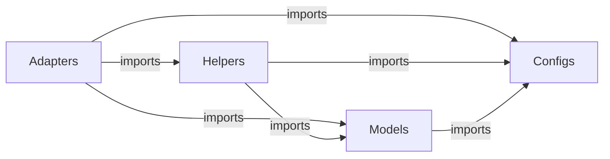

# Get Started


[](https://pypi.org/project/archipy/)
[](https://pypi.org/project/archipy/)
[](community/license.md)
[](https://pypi.org/project/archipy/)
[](https://github.com/SyntaxArc/ArchiPy/actions)
[](https://github.com/SyntaxArc/ArchiPy)

ArchiPy is a Python framework that provides standardized, scalable building blocks for modern applications.
Built on Clean Architecture principles with Python 3.14+, it removes the boilerplate from wiring up databases,
caches, queues, and services — so you focus on business logic.

## In 30 Seconds

Install and run a typed, cached service:

=== "uv"

    ```bash
    uv add "archipy[redis,cache]"
    ```

=== "pip"

    ```bash
    pip install "archipy[redis,cache]"
    ```

```python
from archipy.configs.base_config import BaseConfig
from archipy.adapters.redis.adapters import RedisAdapter
from archipy.helpers.decorators.cache import ttl_cache

config = BaseConfig()
BaseConfig.set_global(config)
redis = RedisAdapter()

@ttl_cache(ttl=60)
def get_user(user_id: str) -> dict:
    return redis.get(f"user:{user_id}")
```

That's it — typed config, live Redis adapter, and a TTL cache, all wired together.

## Why Use ArchiPy?

- **Clean Architecture out of the box** — four strictly separated layers (configs, models, helpers, adapters) enforce
  dependency rules automatically
- **Type-safe everything** — configurations, entities, DTOs, and errors all use Pydantic or SQLAlchemy with full type
  hint support
- **Modular adapters** — install only what you need; each integration (PostgreSQL, Redis, Kafka, Keycloak…) is an
  optional extra
- **Testability first** — every adapter ships with a `ports.py` interface and a `mocks.py` test double, so unit tests
  never need a real database
- **One config system** — environment variables, `.env` files, and runtime overrides all flow through a single validated
  `BaseConfig`
- **Python 3.14+ native** — uses `X | Y` unions, `list[str]` generics, and modern syntax throughout; no legacy
  compatibility shims

See [Concepts](getting-started/concepts.md) for a detailed comparison of ArchiPy against plain FastAPI and Django.

## What ArchiPy Offers

ArchiPy is organized into four layers:

- **Configs** — Type-safe, environment-based configuration via `pydantic_settings.BaseSettings`
- **Models** — Entities (SQLAlchemy), DTOs (Pydantic), Errors, and Types — data structures only, no I/O
- **Helpers** — Pure utilities: decorators (retry, cache, atomic), interceptors (rate limiting, tracing), JWT, password,
  date utils
- **Adapters** — Plug-and-play integrations: PostgreSQL, SQLite, StarRocks, Redis, Kafka, Keycloak, MinIO, ScyllaDB,
  Elasticsearch, Temporal, Email, Payment Gateways

## Architecture Overview

Dependencies flow strictly inward — adapters may import from any inner layer, but inner layers never import outward:



See [Concepts](getting-started/concepts.md) for the full architectural breakdown.

> **Tip:** See the [Tutorials](tutorials/index.md) section for complete, runnable examples for every adapter and helper.

## Next Steps

- [Installation](getting-started/installation.md) — prerequisites, install methods, and optional extras
- [Concepts](getting-started/concepts.md) — understand the Clean Architecture layers and design philosophy
- [Quickstart](getting-started/quickstart.md) — five-minute step-by-step guide
- [Tutorials](tutorials/index.md) — step-by-step guides for every adapter, helper, and feature
- [API Reference](api_reference/index.md) — full reference for all public classes and functions
- [FAQ](community/faq.md) — answers to common questions
- [Contributing](community/contributing.md) — set up a dev environment and contribute to ArchiPy
